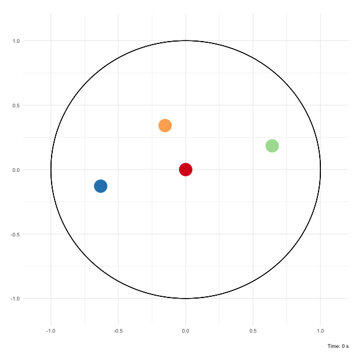

# Mestim

<!-- badges: start -->
[](https://www.r-bloggers.com/2020/07/how-to-write-your-own-r-package-and-publish-it-on-cran/)
[](https://cran.r-project.org/package=Mestim)
[](https://www.repostatus.org/#active)
[](https://github.com/fcgrolleau/Mestim/blob/master/LICENSE.md)
[](https://www.r-project.org)
<!-- badges: end -->

This package provides a flexible framework for estimating the variance-covariance matrix of estimated parameters.
Estimation relies on providing unbiased estimating functions to compute the empirical sandwich variance.
<sub><sup><a href="https://github.com/fcgrolleau/Mestim/blob/master/figures/spins.md">
    what is this?</a> </sup></sub>
:monkey:

### Installation
For latest release
```
library(devtools)
install_github("fcgrolleau/Mestim")
```

For stable release
```
install.packages("Mestim")
```

### Implementation
```
library(Mestim)

# Put estimated parameters in a list
thetas_hat <- list(theta_1=coef(mod)[1], theta_2=coef(mod)[2])

# Build a list of unbiased estimating functions
# NB: parameters' names must be consistent with the previous list
M_1 <- expression( ((1/(1+exp( -( theta_1 * x_1 + theta_2 * x_2 ) ))) - y ) * x_1 )
M_2 <- expression( ((1/(1+exp( -( theta_1 * x_1 + theta_2 * x_2 ) ))) - y ) * x_2 )
est_functions <- list(M_1, M_2)

## Pass arguments to get_vcov and obtain what you are looking for
res <- get_vcov(data=dat, thetas=thetas_hat, M=est_functions)
```
Find more information in the <a href="https://fcgrolleau.github.io/Mestim/vignette/vignette.html"> introduction vignette</a>.

### Authors
This package is written and maintained by François Grolleau (francois.grolleau@aphp.fr).

### References
- Boos DD. and Stefanski, LA.
<b>Essential Statistical Inference.</b> 2013. [<a href="https://doi.org/10.1007/978-1-4614-4818-1">Springer</a>]
- Tsiatis, AA., Davidian, M., Holloway, ST. and Laber, EB.
<b>Dynamic Treatment Regimes: Statistical Methods for Precision Medicine.</b> 2019. [<a href="https://doi.org/10.1201/9780429192692">CRC Press</a>]
