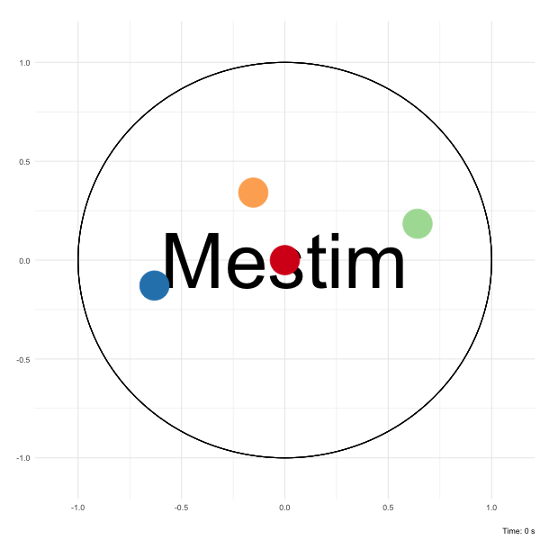

# Mestim
This package provides a flexible framework for estimating the variance-covariance matrix of estimated parameters.
Estimation relies on providing unbiased estimating functions to compute the empirical sandwich variance.
<sub><sup><a href="https://github.com/fcgrolleau/Mestim/blob/master/figures/spins.md">
    what is this?</a> </sup></sub>
:monkey:

### Installation
```
library("devtools")
install_github("fcgrolleau/Mestim")
```

### Implementation
```
library("Mestim")

# Put estimated parameters in a list
thetas_hat <- list(theta_1=coef(mod)[1], theta_2=coef(mod)[2])

# Build a list of unbiased estimating functions
# NB: parameters' names must be consistent with the previous list
M_1 <- expression( ((1/(1+exp( -( theta_1 * x_1 + theta_2 * x_2 ) ))) - y ) * x_1 )
M_2 <- expression( ((1/(1+exp( -( theta_1 * x_1 + theta_2 * x_2 ) ))) - y ) * x_2 )
est_functions <- list(M_1, M_2)

## Pass arguments to get_vcov and obtain what you are looking for
res <- get_vcov(data=dat, thetas=thetas_hat, M=est_functions)
```
Find more information in the <a href="https://github.com/fcgrolleau/Mestim/vignette/vignette.html"> introduction vignette</a>.

### Authors
This package is written and maintained by François Grolleau (francois.grolleau@aphp.fr).

### Reference
Leonard A Stefanski and Dennis D. Boos.
<b>The Calculus of M-Estimation.</b>
2002.
[<a href="https://www.tandfonline.com/doi/abs/10.1198/000313002753631330">The American Statistician</a>]