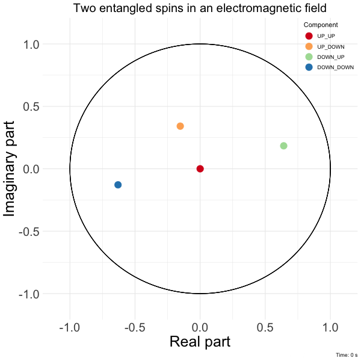

 

Our logo is produced by solving the Schrodinger equation for two spins starting in the singlet state $\ket{\Psi(0)}=\frac{1}{\sqrt{2}}(\ket{ud}-\ket{du})$ and evolving in an electromagnetic field with Hamiltonian $$\mathbf{H}=\begin{pmatrix}
1 & 2+i & 5-4i & 9+2i\\
2-i & 4 & 6i & 4-i\\
5+4i & -6i & 2 & 6+i\\
9-2i & 4+i & 6-i & 7\\
\end{pmatrix}.$$

$$\mathbf{H} =  \begin{pmatrix}
1 & 2+i & 5-4i & 9+2i\\
2-i & 4 & 6i & 4-i\\
5+4i & -6i & 2 & 6+i\\
9-2i & 4+i & 6-i & 7\\
   \end{pmatrix}$$

Denoting respectively $\ket{E_j}$ and $E_j$ the eingenvectors and eignenvalues of $\mathbf{H}$, a solution to the Schrodinger equation is given by
$$\ket{\Psi(t)}=\sum_j \ket{E_j}\bra{E_j}\ket{\Psi(0)}e^{-\frac{i}{\hbar}E_jt}.$$

The code that produces the figure is available <a href="https://github.com/fcgrolleau/Mestim/tree/master/R/schrodinger_dots.R">here</a>.

### Reference
Leonard Susskind and Art Friedman.
<b>Quantum Mechanics: The Theoretical Minimum.</b>
Penguin Books. 2014.
[<a href="https://theoreticalminimum.com/courses/quantum-mechanics/2012/winter/lecture-4">video</a>]